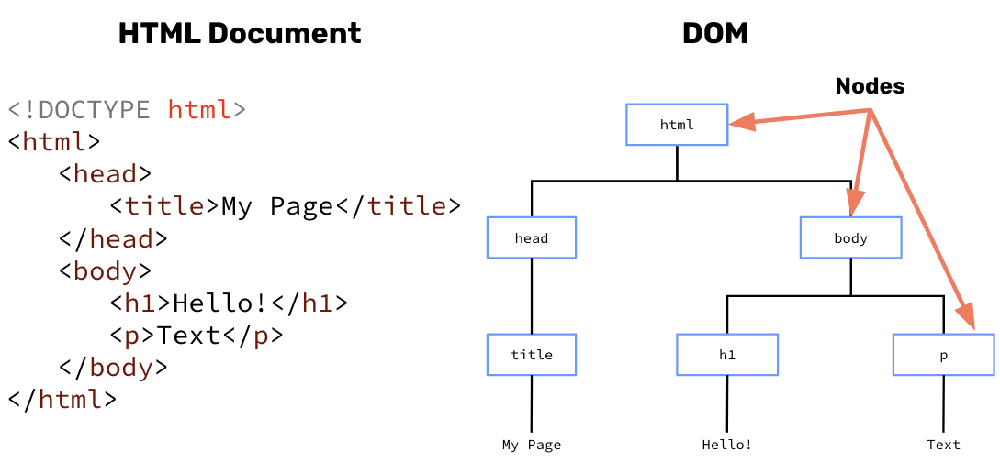
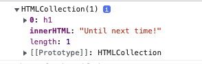

# The DOM

JavaScript is an amazing tool. Thus far, we have learned that JavaScript can be utilized to create:
1. Classes 
2. Objects
3. Databases
4. Servers

That’s not all, Javascript can also be used to manipulate the HTML elements on your webpage. Javascript accomplishes this using the **Document Object Model**. **⭐️ The Document Object Model (DOM) is the data representation of the objects that comprise the structure and content of a document on the web.**

JavaScript views the entire HTML document as an object, where each element can be accessed through a few methods provided by the DOM API. It then creates a model of it in the form of a tree structure in order to access a particular HTML element and perform an operation on it. A basic HTML document converted to DOM would look like:



> [Video Lesson](https://www.loom.com/share/ce04a606e3cf429db26ee3dc963a5f23)

## Try It Out! 💻

You can use any browser to run this, but the directions below are for using Chrome’s developer tools. We recommend you use Chrome for ease of use, but you are welcome to use whatever browser works best for you.

1. Click “Run” and open the link in a new tab.
2. Open the JavaScript console by clicking “View” → “Developer” → “Developer Tools”. You can also use Option + ⌘ + J (on macOS), or Shift + CTRL + J (on Windows/Linux).
3. Look at the console. You should see the h1 element logged:

4. Log the element with the id desc to the console.
5. Looking at your console from step 3 and step 4, an you get the innerHTML for each to log? Can you update the innerHTML and log the new value?

> ***INSERT IDE CODE HERE***

## #checkoutTheDocs 🔍
- **MDN**: [Introduction to the DOM](https://developer.mozilla.org/en-US/docs/Web/API/Document_Object_Model/Introduction)
- **W3Schools**: [The Document Object](https://www.w3schools.com/jsref/dom_obj_document.asp)
- **W3Schools**: [getElementByTagName()](https://www.w3schools.com/jsref/met_document_getelementsbytagname.asp)
- **W3Schools**: [getElementById()](https://www.w3schools.com/jsref/met_document_getelementbyid.asp)
- **W3Schools**: [innerHTML](https://www.w3schools.com/jsref/prop_html_innerhtml.asp)

## Knowledge Check ✅
1. What does the DOM stand for?
    - Document Object Method
    - Document Object Module
    - Document Object Model
    - None of the above

2. Given the following HTML code snippet:
```html
<body>
  <h1 id="q2">Question 2</h1>
  <p id="prompt">Select the correct answer below</p>
</body>
```
Which of the following uses the DOM to update the value of the Heading 1 element?
```js 
document.getElementByTag("h1").innerHTML = "Question Number 2"
```

```js
document.getElementById("h1").html = "Question Number 2"
```

```js
document.getElementById("q2").innerHTML = "Question Number 2"
```

```js
document.getElementsByTagName("p").innerHTML = "Question Number 2"
```