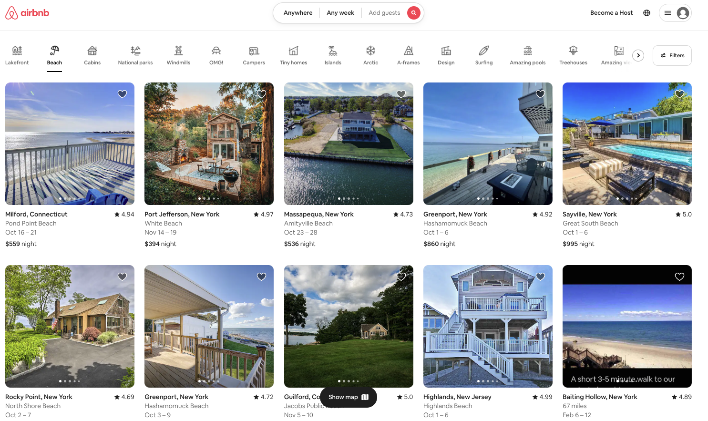

# Introduction to React

[Navigate to AirBnb's homepage](https://www.airbnb.com/).



You now have some experience with HTML/CSS, so can recognize that the general structures like a navigation bar and cards to contain each of the elements. **Do you think a programmer wrote HTML for each of the containers holding a location that can be booked?**

It would be ***wildly*** inefficient for a programmer to “hard code” each individual container holding a location that could be booked. Additionally, hard coding prevents us from customizing the user experience based on where they are accessing the page from (e.g. the image above was accessed on a computer in New York City) and would require a full page reload if we wanted to update the page view of these containers.

Airbnb and many other pages on the Internet are built using React.js. ⭐️ **React is a Javascript library that is used to build user interfaces. React is a particularly powerful tool for building user interfaces because it allows programmers to create reusable components.** For example, if you select the “OMG!” home option, you’ll see that all the containers reload with new content! That is one of the major utilities of React. We can create one component that can easily (and efficiently) be updated with different data.

### What We Will Learn
- JSX
- Babel
- Creating a simple React App

> [Video](https://www.loom.com/share/7c7aefcdc711463194d8ebd894c82750)

## Try It Out! 💻

We are going to build our first React page locally to allow you to see each of the parts. Most React boilerplates will come with file structures already setup, but it’s helpful to build from the ground up so that you have an understanding of all the components.

**TASK**: Complete the following checklist as a guide for initializing our React App using Parcel.

Follow these steps in order to get create your first React application.
- Create a new project folder
- Run the following command: `npm init -y`. This will create a `package.json` for you.
- Run the following command: `npm install parcel`. This will install all the necessary dependencies you’ll need to work with your React project
- Run the following command: `npm install react`. This will install the react library which will be necessary for Babel to convert your JSX to Javascript.
- Run the following command: `npm install react-dom`. This will include the react library which will be necessary in order to render a JSX element on the webpage.
- Include the following as part of the scripts in your `package.json`:
```json
"start": "parcel index.html --open"
```
- Create a new HTML file named index.html that contains: 
    - The Boiler Plate
    - A Title (Optional)
    - A `div` element in the body with an ID of root
- Between your `<body>` and `</body>` tags add the following `script` tag:
```html
<script type="module" src="index.js"></script>
```
- Create a new JavaScript file named `index.js` that contains:
```jsx
import React from "react";
import { createRoot } from 'react-dom/client';

const root = createRoot(document.getElementById('root'));
root.render(<h1>This is JSX, not HTML</h1>);
```
- Run the following command: 
```bash
npm start
```

## #checkoutTheDocs 🔍
- **Parcel**: [React](https://parceljs.org/recipes/react/)
- **React**: [Getting Started](https://reactjs.org/docs/getting-started.html)
- **React**: [Introducing JSX](https://reactjs.org/docs/introducing-jsx.html)
- **React**: [Create Root](https://reactjs.org/docs/react-dom-client.html#createroot)
- [Babel](https://babeljs.io/)