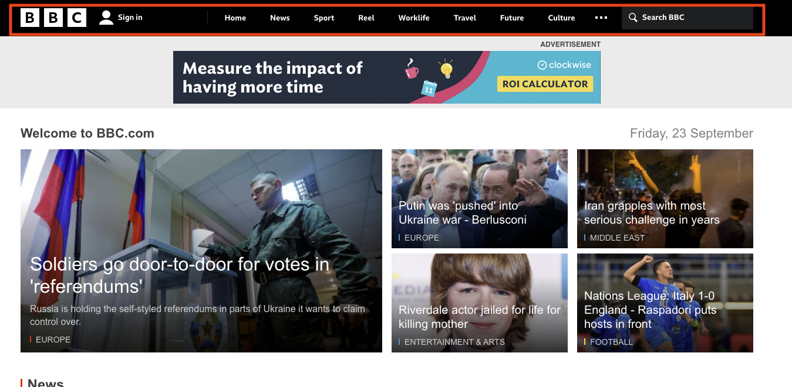
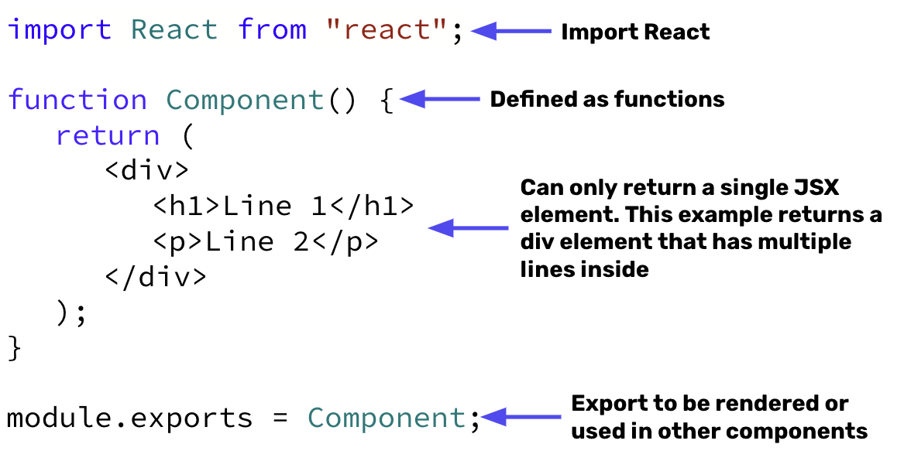

# React Components

Navigate to the homepage for the [BBC](https://www.bbc.com/). Click through a few pages and pay attention to the navigation bar along the top.



If we were creating the BBC homepage using only HTML, we would need to create navigation bar code for every single page. That’s ***a lot*** of copying and pasting to the hundreds of different pages that the BBC domain hosts. Additionally, what if you wanted to change the order (maybe move “Travel” next to the “Sport” tab), we would then need to go back and modify each individual page. 

In the previous section, we introduced that ⭐️ **a core principle of React is to “write once”. React pages are made up of components or independent and reusable bits of code.** Therefore, instead of writing individual navigation bar components on the BBC pages, we instead can make a single Nav component that can then be imported and used on every single page. Any changes we make to the Nav component will then be reflected on any page that utilizes it!

### What We Will Learn
- What is a React Component
- Creating a React Component
- Rendering a React Component

> [Video](https://www.loom.com/share/e58f06ff3fc74bdabc8feceb9f5387df)

## Try It Out! 💻
1. Click “Run”. This may take a few seconds to launch as it needs to install all the React dependencies to your environment. You should see the message “Hello World”. Where is this JSX for this content?
2. Instead of returning a single `h1` element. Update the `Message.js` file to return the `h1` tag AND a `p` tag.
3. Open the `Compound.js` file. Import the `Message.js` file and render a Message component in addition to one additional tag like “This is some compound text!”
4. Finally, render the `Compound` component in `index.js` instead of the `Message` component. Don’t forget to import the component!

> ***INSERT IDE CODE HERE***

## React Component Syntax 🖊


## #checkoutTheDocs 🔍
- **React**: [Components and Props](https://reactjs.org/docs/components-and-props.html)

## Knowledge Check ✅
1. React components MUST start with an uppercase letter?
    - True
    - False

2. Which of the following line(s) of code is creating the React Component?

```jsx
import React from "react"
import ReactDOM from "react-dom"

function Car(){
    return <h1> I am a car! </h1>
}

ReactDOM.render(
    <Car />,
    document.getElementById("root")
)
```

3. Which of the following line(s) of code is displaying the Car component on the web page?
```jsx
import React from "react"
import ReactDOM from "react-dom"

function Car(){
    return <h1> I am a car! </h1>
}

ReactDOM.render(
    <Car />,
    document.getElementById("root")
)
```