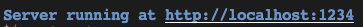

# Ex 1 Instructions and Hello World
These instructions are the same for all the following React exercises, so we will not repeat these setup instructions.

## Running the App
In order to begin creating our React components, we need to create our React app. Follow the list of instructions to get started: 

1. Press Run Button. You may have to click “Run” more than once. Sometimes it only gives the prompt.

2. Click the localhost link that comes up in the console Server running at http://localhost:1234.  That should open a new tab with a unique url like `https://<random-characters>-1234.na.app.codingrooms.com/`


3. You should see your React app displayed


## Running the Tests

The tests will run just as they have all along (using “Check Answer”), with a couple changes:
- The tests take awhile to run for react 😔 
- The output is a bit tricky to understand, just pay attention to the instructions we give and the error messages in the failed tests!

## Things to Note
- In this exercise, you will be writing your components in the `./src/App.js` file. 
    - The component App  will contain all the logic we want to render to our web page.
    - The component App is being exported from the ./src/App.js file
    ```jsx
    export function App(){...}
    ```
- The index.js file imports the App module
```jsx
import { App } from "./App";
```
- The index.js file renders the App module to the webpage
```jsx
const app = document.getElementById("app");
ReactDOM.render(<App />, app);
```

## The Assignment 📝
1. In this exercise, we have provided a single component, App for you.
2. Change the return value of the component to return Hello World in an h2
3. Your solution should look as follows:
