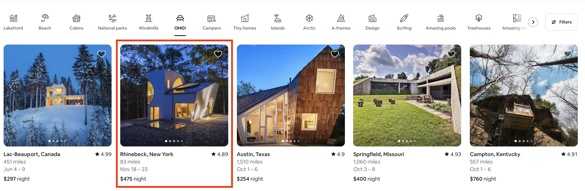

# Mapping and React Props

We now have the tools to start building powerful React pages using React components and props, but there is one more issue we need to solve. On the Airbnb homepage, we identified the container as being a component that could utilize props.



In the last section, we discussed how we could use props to customize each component with relevant information. To render 5 containers, our `App.js` may look something like the code below.

```jsx
function App() {
    return(
      <div>
          <Container image = "pic1.jpg" title = "My Great Home"/>
          <Container image = "pic2.jpg" title = "My Second Great Home"/>
          <Container image = "pic3.jpg" title = "My Third Great Home"/>
          <Container image = "pic4.jpg" title = "My Fourth Great Home"/>
          <Container image = "pic5.jpg" title = "My Fifth Great Home"/>  
      </div>  
    );
}
```

As you can see, this can quickly make our code very long and unreadable (imagine you needed to do 100 containers!). ⭐️ **JSX allows for us to use Javascript to apply logic to the JSX components by simply using curly braces `{}`. We can store information in an array and use the `.map` method to dynamically render our components with props coming in from a list of objects.**

> [Video Lesson](https://www.loom.com/share/31347dbc70dd44d6b7a6b918397ed9f6)

Try It Out! 💻
1. On line 8, create an array called `doubled` that uses `.map()` to double each value contained in the numbers array. Log the new array to the console. Click “Run” and use the developer tools to see the new array (you will need to use the developer tools as it won’t show up in the Coding Rooms console).
2. A `Cars` component and `cars` array have been generated for you already. In `index.js`, use a map function to render 4 `Cars` components (1 for each item in the array). Pass the brand and color as a prop.
3. In `Cars.js`, replace the default text in the `h2` and `p` tags and render the brand and color instead.

> ***INSERT IDE CODE HERE***

## `.map()` Syntax 🖊


## `.map()` and React Components 🖊


## #checkoutTheDocs 🔍
- **MDN**: [Array.prototype.map()](https://developer.mozilla.org/en-US/docs/Web/JavaScript/Reference/Global_Objects/Array/map)
- **React**: [Introducing JSX](https://reactjs.org/docs/introducing-jsx.html#embedding-expressions-in-jsx)

## Knowledge Check ✅
1. What does `.map()` do for us in JavaScript
    - Creates a new array 
    - Performs a function on each item in the array
    - Locates a particular item in the array
    - None of the above

2. (Assuming we have a component, Users referencing the props being rendered)

Which of the following will render a component for each item in the following array of objects
```js
const users = [
  {
    name: "John",
    age: 30
  },
  {
    name: "Sarah",
    age: 32
  }
  
]
```

``` jsx
ReactDOM.render(
  users.map((user) => <Users user={user} />),
  document.getElementById("root")
)
```

```jsx
ReactDOM.render(
  {
    users.map((user) => <Users user={user} />)
  },
  document.getElementById("root")
)
```

```jsx
ReactDOM.render(
  users.map((user) => <Users user={user} />)
)
```

```jsx
ReactDOM.render(
  {
    users.map((user) => <Users user={user} />)
  }
)
```