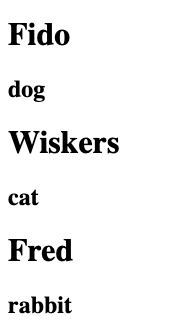

# 📝
In this exercise, you will be using React Props to dynamically render a list of animal objects. You will witness the power of React when combining Javascript logic with your components. 

1. Your task is to create a component named `Animal` that will accept a property `{animal}`.
    - Your component `Animal` is to return a `h1` containing the `props.animal.name` 
    - Your component `Animal` is to return a `h2` containing the `props.animal.species` 

2. Include the Animal component in the App component. 
- Use .map() to map over the list of animal objects
    - For each animal in the list of animals, return the `Animal` component with the following property `animal={animal}`
    - Remember, we have access to the `animal` object via the first parameter passed to the callback in the map function.

Example (but of course with a different component name and prop name):

```jsx
// somewhere before the return statement
const dogs = [
  {
    breed: 'labrador'
  },
  {
    breed: 'chihuahua'
  }
];
// further down, in JSX
{
  dogs.map((dog) => <MyComponent breed={dog.breed}/>)
}
```

3. Your solution should look as follows:
